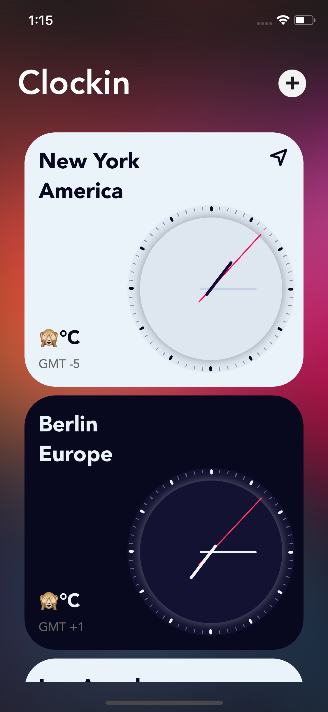
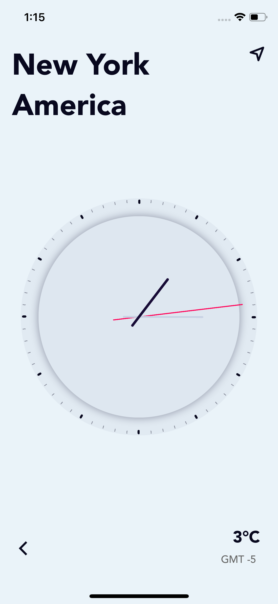
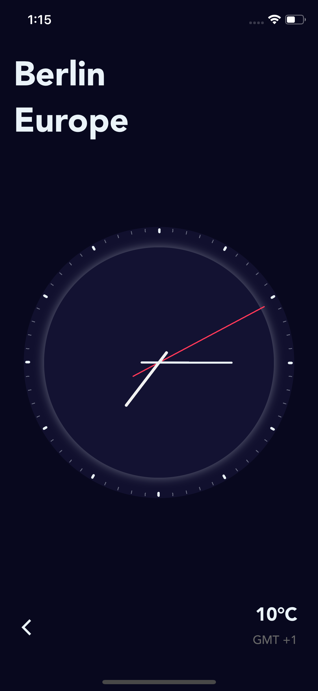

# Clockin
  

## An Experimental Project. 

Clockin is a simple iOS app that lists various timezones in a tableview. Each cell in the tableview includes an animated analog clock written in Swift using `Core Graphics` and `UIKit`.

This application is developed completly from scratch over a weekend. The purpose was to review developing apps using `NSLayoutConstraints` programmatically without a storyboard. And I must say, it's been quite fun to use it programmatically and I can see why it can be more efficient in some cases.

**Full disclosure**: The application has a few UI bugs mainly visible on iPad. Didn't have enough time to fix them.

Additionally, `UIClockView` & `ClockTime` is availble to use under the MIT License.

## License
[MIT License for `UIClockView` & `ClockTime`](LICENSE)
